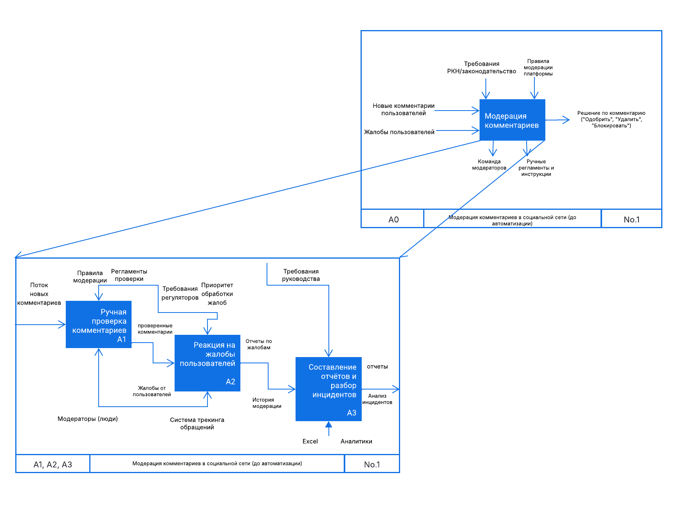
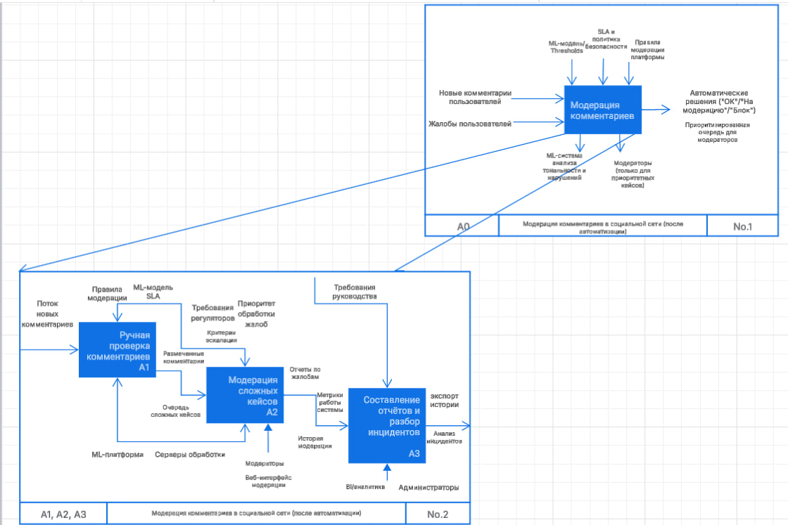

# ML System Design Doc - Система автоматизированного мониторинга тональности комментариев в социальной сети (MVP)

**Команда проекта:**

- Кузнецов Артур Геннадьевич — Product Owner, Data Scientist
- Корчагин Вадим Сергеевич — Data Engineer, Software Architect
- Хисаметдинова Динара Наилевна — Software Engineer, Data Architect

> Термины и пояснения
> 
> - БТ - бизнес-требования
> - БО - бизнес-ограничения
> - MVP - Minimum Viable Product (минимально жизнеспособный продукт)
> - ETL - Extract, Transform, Load (процесс извлечения, преобразования и загрузки данных)
> - API - Application Programming Interface (программный интерфейс приложения)
> - SLA - Service Level Agreement (договор об уровне обслуживания)
> - Latency - задержка отклика системы
> - Precision - точность модели (доля корректных положительных срабатываний)
> - Recall - полнота модели (доля правильно обнаруженных релевантных случаев)
> - F1‑score - гармоническое среднее precision и recall
> - SHAP - SHapley Additive exPlanations (метод интерпретации моделей)
> - LIME - Local Interpretable Model‑agnostic Explanations (локальная интерпретация вывода модели)
> - SMOTE - Synthetic Minority Over‑sampling Technique (аугментация данных для балансировки классов)

## 1. Цели и предпосылки

### 1.1. Зачем идем в разработку продукта?

**Бизнес-цель**

Автоматизировать мониторинг пользовательских реакций на контент (посты, рекламу, новости) в социальной сети для оперативного выявления негатива, улучшения модерации и повышения вовлеченности аудитории.

**Почему станет лучше, чем сейчас, от использования ML**

- Текущий процесс модерации является ручным (модераторы читают выборочные комментарии) или отсутствует вообще
- ML-решение позволит увеличить охват проверяемых комментариев с выборочного до 100%
- Сократится время реакции на негативный и потенциально опасный контент с нескольких часов до минут
- Снизится субъективность в оценке комментариев благодаря единым критериям модели
- Снизятся трудозатраты и стоимость модерации за счет автоматизации и приоритизации проверки комментариев
- Уменьшится риск штрафов и санкций со стороны РКН за несвоевременную модерацию

**Что будем считать успехом итерации с точки зрения бизнеса**

- Автоматизация выявления не менее 90% потенциально неприемлемых комментариев
- Сокращение времени реакции модераторов на проблемный контент до 10 минут
- Сокращение расходов на модерацию не менее чем на 30%
- Отсутствие претензий от РКН по поводу неприемлемого контента после внедрения системы

### 1.2. Бизнес-требования и ограничения

**Краткое описание БТ и ссылки на детальные документы**

- БТ-1: Система должна обрабатывать и классифицировать до 500 000 комментариев ежедневно
- БТ-2: Система должна обнаруживать негативные и потенциально неприемлемые комментарии с точностью не менее 90%
- БТ-3: Система должна предоставлять приоритезированную очередь комментариев для команды модераторов
- БТ-4: Система должна соответствовать требованиям РКН по модерации контента
- БТ-5: Система должна работать в режиме близком к реальному времени (задержка не более 5 минут)
- БТ-6: Система должна обеспечивать сохранение истории модерации для аудита

**Бизнес-ограничения**

- БО-1: Бюджет на разработку и внедрение MVP составляет **3 000 000 рублей**
- БО-2: Срок внедрения MVP — **3 месяца** (срок завершения: **до 31 августа 2025**)
- БО-3: Использование только внутренних серверных мощностей компании
- БО-4: Приоритет на снижение ложноотрицательных срабатываний (пропуск неприемлемого контента)
- БО-5: Необходимость соблюдения законодательства о персональных данных (ФЗ-152)

**Описание бизнес-процесса пилота**

1. Система автоматически классифицирует все поступающие комментарии по тональности (негативные, позитивные, нейтральные)
2. Дополнительно выявляются потенциально неприемлемые комментарии (нарушающие правила площадки и законодательство)
3. Формируется приоритезированная очередь комментариев для проверки модераторами
4. Модераторы проверяют комментарии в порядке приоритета, принимая итоговое решение
5. Обратная связь от модераторов используется для улучшения модели
6. Ведётся аналитика эффективности модерации для отчётности перед руководством и РКН

**Что считаем успешным пилотом? Критерии успеха и возможные пути развития проекта**

- Точность классификации неприемлемых комментариев не менее 90%
- Полнота обнаружения неприемлемых комментариев не менее 95%
- Снижение количества жалоб пользователей на неприемлемый контент на 50%
- Сокращение среднего времени обработки комментариев модераторами на 40%
- Положительные отзывы от команды модераторов о работе с системой

Возможные пути развития:

- Интеграция с системой автоматической блокировки учетных записей пользователей-нарушителей
- Расширение функциональности для работы с изображениями и видео
- Добавление предиктивной аналитики для выявления потенциально проблемных обсуждений

### 1.3. Что входит в скоуп проекта/итерации, что не входит

**На закрытие каких БТ подписываемся в данной итерации**

В текущей итерации (MVP) мы закрываем:

- БТ-1: Обработка 500 000 комментариев ежедневно
- БТ-2: Обнаружение неприемлемых комментариев с точностью 90%
- БТ-3: Формирование приоритезированной очереди для модераторов
- БТ-5: Работа в режиме близком к реальному времени
- БТ-6: Частично - базовая функциональность для аудита модерации

**Что не будет закрыто**

- Полноценный аналитический модуль для анализа трендов и паттернов
- Автоматическая обработка изображений и видео
- Интеграция с внешними системами (кроме базовой интеграции с существующей системой модерации)
- Автоматическая блокировка аккаунтов нарушителей
- Полноценная панель администрирования с расширенной аналитикой

**Описание результата с точки зрения качества кода и воспроизводимости решения**

- Документированный и структурированный код с использованием единого стиля программирования
- CI/CD пайплайн для автоматического тестирования и деплоя компонентов системы
- Контейнеризация всех компонентов с использованием Docker
- Подробная документация API и компонентов системы
- Версионирование моделей и данных
- Автоматизированные тесты с покрытием не менее 80% кода

**Описание планируемого технического долга**

- Оптимизация скорости работы модели для обработки большего количества комментариев
- Расширение многоязычной поддержки
- Полноценная система аудита и отчетности
- Расширенные возможности мониторинга и логирования
- Автоматическая адаптация модели к изменениям в языке пользователей
- Полная интеграция с системами аналитики платформы

### 1.4. Предпосылки решения

- **Гранулярность модели**: обработка на уровне отдельных комментариев
- **Время обработки**: не более 1 секунды на комментарий в среднем
- **Обновление модели**: еженедельное переобучение с учетом новых размеченных данных
- **Используемые данные**: исторические данные комментариев с метками модераторов (не менее 100 000 размеченных комментариев)
- **Языковая специфика**: поддержка русского языка как основного, с возможностью расширения на английский язык в будущем
- **Приоритет модерации**: первостепенно обрабатываются комментарии с высокой вероятностью нарушения правил
- **Постобработка результатов**: модераторы проверяют и подтверждают решения системы, особенно в пограничных случаях

## 2. Методология

### 2.1. Постановка задачи

С технической точки зрения мы решаем задачу **многоклассовой классификации текста** комментариев по следующим категориям:

1. Тональность комментария: позитивная, негативная, нейтральная
2. Наличие признаков нарушения правил площадки:
    - Оскорбления и язык вражды
    - Спам и коммерческая реклама
    - Дезинформация
    - Призывы к противоправным действиям
    - Другие нарушения правил сообщества
3. Приоритет для модерации (на основе комбинации первых двух классификаций)

Дополнительно требуется разработать систему формирования очередей для команды модераторов с учетом приоритетов и нагрузки.

### 2.2. Описание решения

**Основные компоненты системы:**

1. **Подсистема сбора и предобработки данных**
    - Получение комментариев из API социальной сети
    - Очистка и нормализация текстов
    - Формирование векторных представлений
2. **Модель классификации тональности**
    - Определение эмоциональной окраски комментария
    - Выделение основных тем и контекста
3. **Модель выявления нарушений**
    - Классификация комментариев по типам потенциальных нарушений
    - Оценка вероятности нарушения правил
4. **Система приоритизации**
    - Расчет приоритета комментария для модерации
    - Формирование очереди проверки для модераторов
5. **Интерфейс модераторов**
    - Отображение приоритезированных комментариев
    - Инструменты для быстрой модерации
    - Система обратной связи для улучшения модели
6. **Подсистема аналитики и мониторинга**
    - Сбор метрик работы системы
    - Формирование отчетов о производительности
    - Выявление проблемных зон и аномалий

### 2.3. Этапы решения задачи

**Этап 1 - Подготовка данных**

| Название данных         | Есть ли данные в компании           | Требуемый ресурс для получения данных | Проверено ли качество данных |
| ----------------------- | ----------------------------------- | ------------------------------------- | ---------------------------- |
| История комментариев    | База данных `COMMENTS_HISTORY`      | Data Engineer                         | +                            |
| Решения модераторов     | База данных `MODERATION_DECISIONS`  | Data Engineer                         | +                            |
| Жалобы пользователей    | API модуля жалоб, `USER_COMPLAINTS` | Data Engineer                         | -                            |
| Метаданные комментариев | База данных `COMMENT_METADATA`      | Data Engineer                         | -                            |
| Словари стоп-слов       | Нет, требуется создание             | Data Scientist/Лингвист               | -                            |

**Результат этапа:**

- Очищенный и нормализованный корпус текстов комментариев с метками модераторов
- Витрина данных с предобработанными комментариями для обучения и тестирования
- Система ETL для постоянного пополнения обучающей выборки

**Этап 2 - Построение модели классификации тональности**

**Для MVP:**

- Формирование обучающей выборки: 70% исторических данных
- Формирование валидационной выборки: 15% исторических данных
- Формирование тестовой выборки: 15% исторических данных
- Целевая переменная: тональность комментария (позитивная, негативная, нейтральная)
- Метрики качества: F1-score > 0.8, Accuracy > 0.85
- Алгоритм: BERT-подобная архитектура, предобученная на русскоязычных текстах
- Feature engineering: TF-IDF, эмбеддинги слов, статистические признаки текста
- Кросс-валидация: 5-fold cross-validation
- Интерпретация: SHAP values для объяснения решений модели

**Для бейзлайна:**

- LogisticRegression на TF-IDF признаках
- Целевая метрика: Accuracy > 0.7

**Необходимый результат:**

- Обученная модель классификации тональности с точностью не ниже 85%
- API для интеграции модели в сервис
- Документация по интерпретации результатов модели

**Риски и митигация:**

- Риск: Дисбаланс классов в данных - Митигация: взвешивание классов, SMOTE, стратифицированная выборка
- Риск: Низкое качество разметки - Митигация: проведение дополнительной разметки на выборке, оценка согласия аннотаторов
- Риск: Специфический сленг и новые выражения - Митигация: использование субсловных токенов в модели

**Этап 3 - Построение модели выявления нарушений**

**Для MVP:**

- Формирование обучающей выборки: комментарии с решениями модераторов
- Валидационная и тестовая выборки: стратифицированное разделение
- Целевая переменная: наличие нарушения правил (многоклассовая классификация по типам нарушений)
- Метрики качества: Precision > 0.9, Recall > 0.95 для категорий высокого риска
- Алгоритм: Ансамбль трансформерной модели и градиентного бустинга
- Feature engineering: Эмбеддинги текста, признаки автора комментария, контекстуальные признаки
- Кросс-валидация: стратифицированная 5-fold cross-validation
- Интерпретация: LIME для объяснения решений модели

**Для бейзлайна:**

- Random Forest на базе TF-IDF признаков и базовых статистик текста
- Целевая метрика: Precision > 0.7, Recall > 0.8

**Необходимый результат:**

- Обученная модель классификации нарушений с Precision > 0.9 и Recall > 0.95
- Отчет о важности признаков для разных типов нарушений
- Сервис прогнозирования с API

**Риски и митигация:**

- Риск: Экстремально несбалансированные классы - Митигация: синтетические примеры, аугментация данных, подбор метрик и порогов
- Риск: Эволюция языка нарушений - Митигация: регулярное переобучение модели, мониторинг дрейфа
- Риск: Сложность разметки текстов - Митигация: активное обучение, полуавтоматическая разметка

**Этап 4 - Разработка системы приоритизации**

**Для MVP:**

- Формирование правил приоритизации на основе типа нарушения и уверенности модели
- Разработка алгоритма формирования очередей модерации с учетом нагрузки
- Метрики качества: среднее время до проверки высокоприоритетных комментариев < 5 минут

**Для бейзлайна:**

- Простая очередь FIFO для комментариев с нарушениями
- Целевая метрика: обработка всех комментариев в течение 24 часов

**Необходимый результат:**

- Алгоритм приоритизации с учетом типа нарушения, контекста и предыдущих действий пользователя
- Система формирования задач для модераторов с учетом их специализации
- Интерфейс для настройки правил приоритизации

**Риски и митигация:**

- Риск: Перегрузка модераторов определенными типами контента - Митигация: динамическая балансировка задач
- Риск: Недостаточная пропускная способность - Митигация: автоматическое масштабирование ресурсов

**Этап 5 - Интеграция и развертывание системы**

**Для MVP:**

- Разработка API для интеграции с существующими системами
- Создание базового интерфейса для модераторов
- Настройка мониторинга основных метрик системы

**Для бейзлайна:**

- Пакетная обработка комментариев с ручной передачей результатов
- Excel-отчеты по результатам классификации

**Необходимый результат:**

- Работающая система в продакшн-среде
- Документация по API и процессам обновления моделей
- Набор базовых метрик для мониторинга качества работы системы

**Риски и митигация:**

- Риск: Сложности интеграции с существующей инфраструктурой - Митигация: использование микросервисной архитектуры, контейнеризация
- Риск: Производительность при высоких нагрузках - Митигация: стресс-тестирование, горизонтальное масштабирование

## 3. Подготовка пилота

### 3.1. Способ оценки пилота

Пилотное внедрение системы будет проводиться в следующем формате:

1. **A/B тестирование**:
    - Группа A: традиционный процесс модерации
    - Группа B: модерация с помощью разработанной ML-системы
2. **Период тестирования**: 2 недели
3. **Объем данных**: 20% от общего потока комментариев (около 100,000 комментариев ежедневно)
4. **Метрики для сравнения**:
    - Количество обработанных комментариев
    - Время обработки комментариев
    - Количество пропущенных нарушений
    - Удовлетворенность модераторов
    - Удовлетворенность пользователей

Дополнительно будет проведена экспертная оценка результатов работы системы независимой группой модераторов для валидации качества классификации.

### 3.2. Что считаем успешным пилотом

Пилот будет считаться успешным при достижении следующих показателей:

1. **Качество классификации**:
    - Precision > 90% для неприемлемых комментариев
    - Recall > 95% для неприемлемых комментариев
    - F1-score > 92% для тональности комментариев
2. **Производительность системы**:
    - Среднее время обработки комментария < 1 секунды
    - Задержка между публикацией и классификацией < 5 минут
    - Стабильная работа системы под нагрузкой 10+ комментариев в секунду
3. **Бизнес-эффекты**:
    - Сокращение времени модерации на 40%
    - Снижение количества пропущенных нарушений на 50%
    - Положительная обратная связь от не менее 70% модераторов
4. **Технические метрики**:
    - Доступность системы > 99.9%
    - CPU/RAM утилизация < 70% при пиковых нагрузках

### 3.3. Подготовка пилота

**Оценка вычислительной сложности**:

- Пропускная способность: 500,000 комментариев / 86,400 секунд ≈ 6 комментариев в секунду в среднем
- Пиковые нагрузки: до 30 комментариев в секунду
- Расчетное использование ресурсов:
    - CPU: 8-16 ядер для обработки запросов
    - RAM: 32-64 ГБ для моделей и обработки данных
    - GPU: 1-2 NVIDIA T4 для инференса моделей
    - Дисковое пространство: 1 ТБ для хранения моделей, логов и данных

**Ограничения пилота**:

- Ограничение на длину комментария: до 2000 символов
- Поддержка только русского языка
- Упрощенная система приоритизации
- Ограниченный набор категорий нарушений (5 основных типов)
- Минимальная интеграция с существующими системами

## 4. Внедрение

### 4.1. Архитектура решения


### IDEF0 до внедрения автоматизации



### IDEF0 после внедрения автоматизации



**Основные компоненты архитектуры**:

1. **API-шлюз**
    
    Единая точка входа для приёма запросов (`POST /comments/analyze`) и маршрутизации трафика ко всем внутренним сервисам.
    
2. **Сервис загрузки данных (Ingestion)**
    
    Получает комментарии от API-шлюза, сохраняет «сырые» тексты в HDFS-кластер и ставит задачу на предобработку.
    
3. **Сервис предобработки текста (Preprocessing)**
    
    Читает «сырые» комментарии, очищает их, нормализует (токенизация, удаление «шумовых» символов) и сохраняет результаты в S3-озеро данных.
    
4. **Сервисы инференса**
    
    - **Sentiment Inference** — считывает векторы из S3, предсказывает тональность и сохраняет результат в SQL-кластер.
    - **Violation Inference** — аналогично, но классифицирует нарушения по категориям и сохраняет в ту же SQL-базу.
5. **Сервис расчёта приоритета (Priority Calculation)**
    
    Извлекает последние предсказания из SQL-кластера, вычисляет приоритет для каждого комментария и помещает его в NoSQL-очередь.
    
6. **Очередь сообщений (NoSQL-кластер)**
    
    Хранит приоритетную очередь для модераторов — обеспечивает быстрое извлечение и масштабируемую обработку.
    
7. **Веб-интерфейс модераторов**
    
    Отображает приоритетную очередь, позволяет модератору принимать решения и отправлять обратную связь.
    
8. **Сервис сбора обратной связи (Feedback Collector)**
    
    Принимает метки «правильно/неправильно» от UI, связывает их с конкретными предсказаниями и архивирует в S3-озере для дообучения.
    
9. **Система мониторинга и логирования (Metrics & Logs)**
    
    Все сервисы отправляют метрики (latency, error rate) в TimeSeries DB; мониторинговый сервис (MON) опрашивает эту базу, агрегирует показатели, строит дашборды и выдаёт алерты в случае отклонений.
    

### 4.2. Описание инфраструктуры и масштабируемости

**Выбранная инфраструктура**: Kubernetes-кластер внутри корпоративного ЦОД или частного облака.

**Плюсы выбора**:

- **Горизонтальное масштабирование**
    
    Каждый микросервис (Ingestion, Preprocessing, Inference, Priority, Feedback) и хранилище (HDFS, S3-озеро, SQL, NoSQL, TimeSeries) можно увеличивать независимо под пиковые нагрузки.
    
- **Авто-рестарт и self-healing**
    
    Kubernetes автоматически перезапускает упавшие поды, поддерживает необходимые реплики и обеспечивает высокий Uptime.
    
- **CI/CD-конвейер**
    
    Автоматический билд, тестирование и выкатка новых версий ML-моделей и сервисов без простоев.
    
- **Изолированная сеть и RBAC**
    
    Чёткое разграничение прав доступа между сервисами, шифрование трафика внутри кластера.
    

**Минусы выбора**:

- **Сложность начальной настройки**
    
    Требуется опыт DevOps-инженеров для конфигурации кластера, ingress-контроллеров, Secret-менеджмента.
    
- **Рост операционных затрат**
    
    Поддержка кластера, обновления, резервирование и мониторинг требуют дополнительных ресурсов.
    

**Альтернативы**:

1. **Монолит на виртуальной машине**
    
    Простой деплой, но ограниченная масштабируемость и высокая связность компонентов.
    
2. **Serverless-функции**
    
    Платишь за фактическое выполнение, но есть ограничения по времени обработки и сложнее отлаживать ML-инференс.
    

**Финальный выбор лучше альтернатив, потому что**:

- Позволяет **быстро масштабировать** компоненты по CPU/RAM/GPU с учётом SLA (P95 < 500 мс).
- Поддерживает **stateful** и **stateless** нагрузки (очередь, базы данных, inference-под).
- Интегрируется с облачными провайдерами для **распределённого хранения** (S3, HDFS-NFS) и **сервисов мониторинга**.
- Соответствует ограничению на использование **внутренних серверных мощностей** и корпоративных политик безопасности.```

### 4.3. Требования к работе системы

- **SLA**: 99.9% доступность системы (допустимый простой не более 43 минут в месяц)
- **Пропускная способность**:
    - Средняя: 6 комментариев в секунду
    - Пиковая: до 30 комментариев в секунду
- **Latency**:
    - Классификация комментария: P95 < 500 мс
    - Формирование очереди модерации: P95 < 1000 мс
    - Получение решения модератора: P95 < 200 мс
- **Объем данных**:
    - Хранение до 180 млн комментариев в год
    - Хранение логов и метрик за последние 90 дней
- **Масштабируемость**: горизонтальное масштабирование для увеличения нагрузки в 2-3 раза без изменения архитектуры

### 4.4. Безопасность системы

**Потенциальные уязвимости**:

- Атаки типа "отказ в обслуживании" (DoS)
- Попытки обхода модерации через манипуляцию входными данными
- Несанкционированный доступ к API и данным
- Атаки на модель через adversarial examples
- Попытки воздействия на решения модераторов

**Меры защиты**:

- Аутентификация и авторизация всех запросов к API
- Ограничение частоты запросов (rate limiting)
- Валидация и санитизация входных данных
- Шифрование данных в процессе передачи и хранения
- Регулярный аудит безопасности
- Мониторинг подозрительной активности

### 4.5. Безопасность данных

- Все персональные данные пользователей обрабатываются в соответствии с Федеральным законом "О персональных данных" (152-ФЗ)
- Анонимизация данных для обучения моделей
- Ограниченный доступ к полным данным пользователей
- Журналирование всех действий с персональными данными
- Регулярные аудиты соответствия требованиям законодательства
- Регламент хранения и удаления данных в соответствии с политикой компании

### 4.6. Издержки

**Расчетные издержки на работу системы в месяц:**

- **Вычислительные ресурсы (на 1 месяц):**
    - CPU (16 ядер): ≈ 11 520 ядро-часов ≈ **92 160 ₽**
    - RAM (64 ГБ): ≈ 46 080 ГБ-часов ≈ **55 296 ₽**
    - GPU (2 NVIDIA T4): ≈ 1 440 GPU-часов ≈ **172 800 ₽**
    - Сетевой трафик: ~10 ТБ ≈ **15 000 ₽**
    - Хранение данных (1 ТБ SSD): ≈ **8 000 ₽**
- **Персонал (в месяц):**
    - DevOps-инженер (0.5 ставки): **90 000 ₽**
    - ML-инженер (1 ставка): **180 000 ₽**
    - Data Analyst (0.5 ставки): **85 000 ₽**
    - **Итого ФОТ:** **355 000 ₽**
- **Прочие расходы:**
    - Подписки (GitHub, мониторинг, трекеры задач): **20 000 ₽**
    - Закладка на инциденты и поддержку SLA: **30 000 ₽**

---

**Итого примерные издержки на MVP в месяц:**

- Инфраструктура: **343 256 ₽**
- Персонал: **355 000 ₽**
- Прочие расходы: **50 000 ₽**
- **Итого в месяц: ~748 000 ₽**
- **Итого на 3 месяца разработки MVP: ~2 244 000 ₽**

---

**Закладываем резерв 15% на риски и непредвиденные расходы: ≈ 336 600 ₽**

**Итоговый бюджет MVP: ≈ 2 580 000 ₽ (в рамках ограничения в 3 000 000 ₽)**

### 4.7. ‘Бутылочные горлышки’ системы

|Компонент|Потенциальное ограничение|Влияние на систему|Меры по устранению|
|---|---|---|---|
|Очередь сообщений|Переполнение при пиковых нагрузках|Задержки в обработке|Масштабирование, увеличение партиций|
|Inference-сервис (ML API)|Высокая задержка инференса модели|Рост latency, невозможность real-time|Выделение GPU, оптимизация модели|
|База данных|Большое число одновременных запросов|Задержки записи/чтения, timeouts|Индексация, шардинг, кэширование|
|Web-интерфейс модераторов|Много одновременных сессий|Тормоза UI, задержка отклика|CDN, масштабирование фронта|
|Система мониторинга|Много алертов/логов при сбоях|Потеря части метрик, "шум" в оповещениях|Буферизация, агрегация алертов|

### 4.8. Риски и неопределенности

**Технические:**

- Drift данных и изменение пользовательского поведения — потребуется регулярное переобучение моделей
- Перегрузка системы в пиковые часы — необходим стресс-тест и автошкалирование
- Ошибки классификации могут привести к блокировке "хороших" комментариев — важно внедрить систему ручной валидации на первом этапе

**Бизнесовые:**

- Сопротивление команды модераторов новому процессу — требуется обучение и обратная связь
- Регуляторные риски — соблюдение 152-ФЗ, требования к хранению и доступу к данным
- Финансовые ограничения — важно достигать ощутимых эффектов в рамках MVP

### 4.9. Сценарии нагрузочного тестирования

Планируется проведение следующих нагрузочных тестов для проверки устойчивости и масштабируемости системы:

|Тестовый сценарий|Описание|Метрики/Параметры|Ожидаемый результат|
|---|---|---|---|
|Пиковая нагрузка (inference)|50 комментариев/сек на анализ|Latency, пропускная способность, CPU/GPU usage|Latency P95 < 1 сек, SLA выдержан|
|Массовый ввод данных|Импорт 1 млн. исторических комментариев|Throughput, ошибки записи|Не менее 95% успеха, <1% потерь|
|Одновременно работающие модераторы|100 модераторов одновременно в UI|UI latency, ошибки в API|UI не тормозит, 0 критических ошибок|
|Отказ одного компонента|Остановка очереди, ML-сервиса или базы|Время восстановления, сохранность данных|Failover ≤ 2 мин, данных не потеряно|
|Шторм алертов/логов|10к алертов в минуту|Потеря логов/алертов|Не более 1% потерь, система не виснет|

---

## 5. Заключение и дальнейшие шаги

- После завершения пилота и анализа результатов будет принято решение о расширении функционала системы.
- Возможные направления развития:
    - Поддержка мультимодального анализа (видео, изображения)
    - Внедрение real-time адаптации моделей
    - Построение рекомендательной системы для автоматизации ответов от имени сообщества

---

## Ссылки

- 🔗 **Репозиторий проекта:** https://github.com/i-am-dak0ta/ITMO-ACS-ISD-2025
- 📁 **Диаграммы и схемы:** находятся в папке `diagrams/` репозитория и включают:
    - IDEF0-диаграммы бизнес-процессов до/после внедрения
    - ER-диаграмму базы данных
    - Архитектурную диаграмму
    - UML-диаграммы: классов, компонентов, последовательностей
