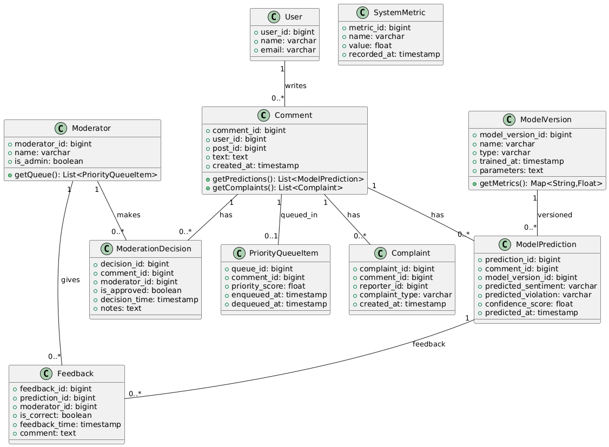

```
@startuml
' Сущности из ERD + основные методы

class Comment {
  +comment_id: bigint
  +user_id: bigint
  +post_id: bigint
  +text: text
  +created_at: timestamp
  +getPredictions(): List<ModelPrediction>
  +getComplaints(): List<Complaint>
}

class ModerationDecision {
  +decision_id: bigint
  +comment_id: bigint
  +moderator_id: bigint
  +is_approved: boolean
  +decision_time: timestamp
  +notes: text
}

class Complaint {
  +complaint_id: bigint
  +comment_id: bigint
  +reporter_id: bigint
  +complaint_type: varchar
  +created_at: timestamp
}

class ModelPrediction {
  +prediction_id: bigint
  +comment_id: bigint
  +model_version_id: bigint
  +predicted_sentiment: varchar
  +predicted_violation: varchar
  +confidence_score: float
  +predicted_at: timestamp
}

class ModelVersion {
  +model_version_id: bigint
  +name: varchar
  +type: varchar
  +trained_at: timestamp
  +parameters: text
  +getMetrics(): Map<String,Float>
}

class PriorityQueueItem {
  +queue_id: bigint
  +comment_id: bigint
  +priority_score: float
  +enqueued_at: timestamp
  +dequeued_at: timestamp
}

class Feedback {
  +feedback_id: bigint
  +prediction_id: bigint
  +moderator_id: bigint
  +is_correct: boolean
  +feedback_time: timestamp
  +comment: text
}

class SystemMetric {
  +metric_id: bigint
  +name: varchar
  +value: float
  +recorded_at: timestamp
}

class User {
  +user_id: bigint
  +name: varchar
  +email: varchar
}

class Moderator {
  +moderator_id: bigint
  +name: varchar
  +is_admin: boolean
  +getQueue(): List<PriorityQueueItem>
}

Comment "1" -- "0..*" ModerationDecision : has
Comment "1" -- "0..*" Complaint : has
Comment "1" -- "0..*" ModelPrediction : has
Comment "1" -- "0..1" PriorityQueueItem : queued_in
ModelVersion "1" -- "0..*" ModelPrediction : versioned
ModelPrediction "1" -- "0..*" Feedback : feedback
User "1" -- "0..*" Comment : writes
Moderator "1" -- "0..*" ModerationDecision : makes
Moderator "1" -- "0..*" Feedback : gives
@enduml
```