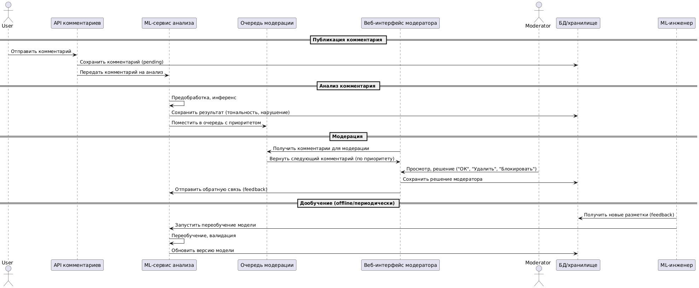

### **Основные участники процесса:**

- **Пользователь** — оставляет комментарии к постам.
- **API комментариев** — сервис, принимающий и валидирующий новые комментарии.
- **ML-сервис анализа** — осуществляет автоматическую обработку и оценку комментариев.
- **Очередь модерации** — система для приоритизации комментариев для проверки.
- **Веб-интерфейс модератора** — рабочее место для ручной модерации.
- **Модератор** — проверяет спорные/важные комментарии и принимает решения.
- **БД/хранилище** — централизованное место хранения всех данных, предсказаний, решений и обратной связи.
- **ML-инженер** — отвечает за обновление и переобучение ML-моделей.



```jsx
@startuml
actor User as Пользователь
participant "API комментариев" as API
participant "ML-сервис анализа" as ML
participant "Очередь модерации" as Queue
participant "Веб-интерфейс модератора" as ModUI
actor Moderator as Модератор
participant "БД/хранилище" as DB
participant "ML-инженер" as MLEngineer

== Публикация комментария ==
Пользователь -> API : Отправить комментарий
API -> DB : Сохранить комментарий (pending)
API -> ML : Передать комментарий на анализ

== Анализ комментария ==
ML -> ML : Предобработка, инференс
ML -> DB : Сохранить результат (тональность, нарушение)
ML -> Queue : Поместить в очередь с приоритетом

== Модерация ==
ModUI -> Queue : Получить комментарии для модерации
Queue -> ModUI : Вернуть следующий комментарий (по приоритету)
Модератор -> ModUI : Просмотр, решение ("ОК", "Удалить", "Блокировать")
ModUI -> DB : Сохранить решение модератора
ModUI -> ML : Отправить обратную связь (feedback)

== Дообучение (offline/периодически) ==
MLEngineer -> DB : Получить новые разметки (feedback)
MLEngineer -> ML : Запустить переобучение модели
ML -> ML : Переобучение, валидация
ML -> DB : Обновить версию модели

@enduml
```

### **Пошаговый сценарий (workflow):**

### **1. Публикация комментария**

- Пользователь отправляет комментарий через API.
- API сохраняет комментарий со статусом “pending” в базе данных.
- API инициирует отправку комментария на автоматический анализ в ML-сервис.

### **2. Анализ комментария**

- ML-сервис выполняет предобработку текста и инференс (оценка тональности, наличие нарушений).
- Результаты анализа (метки, уверенность) сохраняются в базе данных.
- Комментарий с результатом анализа передаётся в очередь модерации, где ему присваивается приоритет.

### **3. Модерация**

- Веб-интерфейс модератора запрашивает из очереди следующий комментарий для проверки.
- Модератор получает комментарий с предсказаниями ML и принимает решение (“ОК”, “Удалить”, “Блокировать”).
- Решение модератора фиксируется в базе данных.
- Одновременно обратная связь отправляется обратно в ML-сервис для накопления примеров ошибок/корректных решений.

### **4. Дообучение модели (offline, периодически)**

- ML-инженер по расписанию выгружает новую обратную связь из БД.
- Инициирует процесс переобучения (retrain) модели на новых данных.
- После переобучения и валидации новая версия модели обновляется в ML-сервисе.
- Система переходит к обслуживанию новых комментариев с улучшенной моделью.