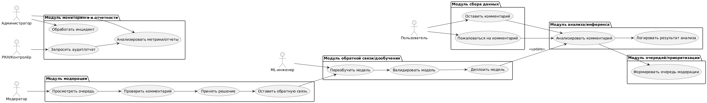

| Актор          | Сценарий                          |                                                                                                                                                                                             |                                              |                                        |
| -------------- | --------------------------------- | ------------------------------------------------------------------------------------------------------------------------------------------------------------------------------------------- | -------------------------------------------- | -------------------------------------- |
| Пользователь   | Оставляет комментарий             | 1. Пишет и отправляет комментарий. 2. Комментарий попадает в систему. 3. Получает уведомление/ожидание публикации.                                                                    | Комментарий принят в систему                 | Удовлетворённость пользователей        |
| ML-платформа   | Анализирует комментарий           | 1. Получает новый комментарий. 2. Предобрабатывает текст 3. Оценивает тональность и признаки нарушения. 4. Сохраняет предсказание в БД.                                            | Комментарий размечен по тональности и рискам | Охват модерации, Latency               |
| Очередь/Бэкенд | Формирует очередь модерации       | 1. Получает предсказание. 2. Рассчитывает приоритет. 3. Помещает комментарий в очередь. 4. Обеспечивает сортировку по приоритету/нагрузке.                                         | Приоритезированная очередь для модераторов   | Скорость реакции, Снижение затрат      |
| Модератор      | Проверяет и решает по комментарию | 1. Получает очередь в веб-интерфейсе. 2. Просматривает комментарий. 3. Принимает решение (“ОК”, “Удалить”, “Блокировать”). 4. Оставляет обратную связь. 5. Решение сохраняется. | Быстрое и корректное принятие решений        | Скорость модерации, Качество модерации |
| ML-платформа   | Получает обратную связь           | 1. Получает решение модератора. 2. Сохраняет как feedback. 3. Использует для последующего обучения модели.                                                                            | Увеличение точности ML-модели                | Качество классификации                 |
| Администратор  | Анализирует отчеты и метрики      | 1. Открывает дашборд/отчет. 2. Получает информацию о задержках, ошибках, инцидентах, трендах. 3. Принимает решения по оптимизации и ресурсам.                                         | Улучшение контроля, обеспечение SLA          | SLA, Устойчивость                      |
| ML-инженер     | Обновляет/переобучает модель      | 1. Анализирует drift и обратную связь. 2. Запускает переобучение. 3. Валидирует качество. 4. Деплоит новую модель. 5. Логирует изменения.                                       | Актуальные и эффективные модели              | Стабильность и качество ML             |
| РКН/Контролёр  | Запрашивает аудит модерации       | 1. Отправляет запрос на отчет. 2. Получает выгрузку с подробной историей модерации и метриками. 3. Проводит аудит полноты и корректности.                                             | Соответствие регуляторным требованиям        | Отсутствие штрафов/санкций             |

## Типовые use cases

### Use-case: **Модератор проверяет комментарий**

**Актор:** Модератор

**Цель:** Быстро и корректно принять решение по сложному/приоритетному комментарию

**Сценарий:**

1. Открывает веб-интерфейс модератора.
2. Видит отсортированный по приоритету список комментариев (очередь).
3. Нажимает на комментарий — видит его текст, предсказанную тональность, вероятное нарушение и “уверенность” модели.
4. Принимает решение: “Оставить”, “Удалить”, “Блокировать пользователя”.
5. При необходимости пишет пояснение или добавляет тег.
6. Решение автоматически сохраняется в системе и отображается в общей статистике.
7. Система сохраняет обратную связь для последующего обучения ML-модели.

**Ожидаемый результат:**

- Комментарий обработан корректно и быстро
- Решение попало в отчет и может быть использовано для аудита и переобучения

**Связанные бизнес-метрики:**

- Время обработки приоритетного комментария
- Количество ошибок/оспоренных решений
- Отсутствие жалоб пользователей и штрафов

---

### Use-case: **Пользователь оставляет комментарий**

**Актор:** Пользователь

**Цель:** Оставить комментарий под постом.

**Сценарий:**

1. Открывает пост в социальной сети.
2. Вводит текст комментария и нажимает “Отправить”.
3. Система валидирует длину/содержимое.
4. Если валидация успешна — сохраняет комментарий (может сразу отобразить или отправить “на модерацию”).
5. Пользователь получает уведомление о публикации или статусе “на модерации”.

**Ожидаемый результат:**

- Комментарий принят в систему и отправлен на анализ.
- Пользователь удовлетворён процессом публикации.

**Связанные бизнес-метрики:**

- Доля успешно опубликованных комментариев
- Время появления комментария на странице
- Удовлетворённость пользователей (NPS)

---

### Use-case: **ML-платформа анализирует комментарий**

**Актор:** ML-платформа (сервис)

**Цель:** Автоматически оценить и разметить комментарий по тональности и нарушениям.

**Сценарий:**

1. Получает новый комментарий из очереди.
2. Выполняет очистку и нормализацию текста.
3. Преобразует текст в векторные представления.
4. ML-модель определяет тональность (позитив, негатив, нейтрально).
5. Вторая ML-модель выявляет признаки нарушений и определяет вероятность.
6. Сохраняет результаты анализа и уверенность моделей в базу.
7. Передает результат в очередь приоритезации/модерации.

**Ожидаемый результат:**

- Каждый комментарий размечен по тональности и потенциальным нарушениям.
- Данные готовы для передачи в модуль приоритезации.

**Связанные бизнес-метрики:**

- Время анализа одного комментария (latency)
- Доля корректно размеченных комментариев (качество ML)
- Доля неразмеченных/ошибочных случаев

---

### Use-case: **Формирование очереди модерации**

**Актор:** Система очередей / Бэкенд

**Цель:** Приоритезировать и отсортировать комментарии для ручной проверки.

**Сценарий:**

1. Получает результаты ML-анализа (тональность, нарушения, score).
2. Рассчитывает приоритет по заданным правилам (тип нарушения, уверенность, жалобы).
3. Помещает комментарий в очередь с определённым приоритетом.
4. Обеспечивает доступ модераторам к приоритезированной очереди.

**Ожидаемый результат:**

- Модераторы получают отсортированный поток задач — сначала самые важные.
- Очередь обновляется в реальном времени.

**Связанные бизнес-метрики:**

- Среднее время до обработки приоритетных комментариев
- Снижение средней задержки модерации (latency)
- Охват ручной модерации

---

### Use-case: **ML-платформа получает обратную связь от модератора**

**Актор:** ML-платформа

**Цель:** Использовать feedback модератора для переобучения моделей.

**Сценарий:**

1. Получает итоговое решение модератора и сопутствующий feedback.
2. Сохраняет метку "верно/ошибка" в базу feedback.
3. Формирует новую тренировочную выборку.
4. При достижении нужного объёма запускает процесс переобучения модели.
5. Обновляет версию модели в сервисе инференса.

**Ожидаемый результат:**

- Модель адаптируется к новым паттернам и ошибкам.
- Качество классификации повышается со временем.

**Связанные бизнес-метрики:**

- Улучшение точности/recall после переобучения
- Снижение числа ошибок и ручных вмешательств
- Скорость реакции ML на новые паттерны нарушений

---

### Use-case: **Администратор анализирует отчеты и метрики**

**Актор:** Администратор

**Цель:** Контролировать эффективность, SLA, быстро выявлять проблемы.

**Сценарий:**

1. Открывает дашборд или получает отчет по email.
2. Смотрит ключевые метрики: скорость обработки, качество, количество инцидентов.
3. Выявляет отклонения (например, всплеск жалоб, рост времени ожидания).
4. Принимает меры — эскалирует проблему, расширяет ресурсы или инициирует дообучение модели.

**Ожидаемый результат:**

- Система остаётся устойчивой и эффективной.
- Инциденты фиксируются и устраняются быстро.

**Связанные бизнес-метрики:**

- SLA (доступность, задержки)
- Число инцидентов за период
- Время восстановления после сбоя (MTTR)

---

### Use-case: **ML-инженер обновляет модель**

**Актор:** ML-инженер

**Цель:** Повысить точность, снизить дрейф, минимизировать ручной труд.

**Сценарий:**

1. Анализирует отчёты о дрейфе/качествах модели.
2. Подготавливает свежую обучающую выборку (включая feedback).
3. Запускает переобучение модели.
4. Валидирует новую версию на тестовой выборке.
5. Развёртывает модель в production (через CI/CD).
6. Логирует изменения и отправляет оповещение команде.

**Ожидаемый результат:**

- Новая модель превосходит предыдущую по метрикам.
- Процесс обновления прозрачен и контролируем.

**Связанные бизнес-метрики:**

- Рост F1, Recall, Precision
- Снижение доли ручных жалоб/обработок
- Частота обновлений моделей

---

### Use-case: **РКН/Контролёр запрашивает аудит**

**Актор:** РКН/Контролёр

**Цель:** Убедиться в корректности, полноте и своевременности модерации.

**Сценарий:**

1. Формулирует и отправляет запрос на аудит (через интерфейс или email).
2. Система подготавливает выгрузку истории решений, отчет по модерации и логи.
3. Контролёр получает и анализирует отчёт.
4. При необходимости запрашивает уточняющие данные.
5. По итогам может быть выдано предписание или проведена проверка.

**Ожидаемый результат:**

- Аудит успешно пройден, регулятор не выносит штрафов.
- История модерации и логи доступны и прозрачны.

**Связанные бизнес-метрики:**

- Количество предписаний/штрафов
- Время ответа на запросы регулятора
- Процент успешных аудитов