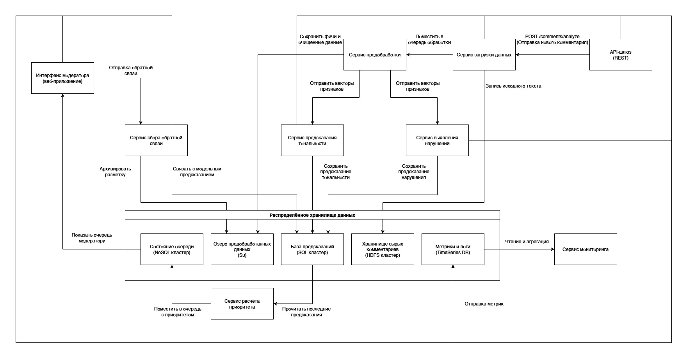

## Распределённое хранение данных

В самом верху мы объединили пять баз в один **пакет «Distributed Storage Layer»** — это показывает, что данные разбросаны по разным хранилищам под разную задачу:

|Компонент|Описание|Тип хранилища|
|---|---|---|
|**Raw Comments Storage (HDFS Cluster)**|Здесь лежат «сырые» данные — все поступившие комментарии до обработки.|Распределённая файловая система HDFS, оптимальна для больших объёмов неструктурированных данных.|
|**Processed Data Lake (S3)**|Предобработанные тексты, векторные представления, промежуточные витрины.|Объектное хранение (аналог Amazon S3) — удобно и дешево держать фичи и результаты очистки.|
|**Predictions DB (SQL Cluster)**|Результаты предсказаний моделей: тональность и нарушения.|Кластер реляционной БД для быстрых запросов и аналитики.|
|**Queue State (NoSQL Cluster)**|Очередь модерации: приоритетные задачи для модераторов.|NoSQL (например, Cassandra или Redis) — низкая задержка, легко масштабируется при большом числе операций enqueue/dequeue.|
|**Monitoring Metrics (TimeSeries DB)**|Служебные метрики: задержки, throughput, drift-метрики.|TimeSeries-хранилище (InfluxDB, Prometheus и т.п.) для хранения метрик с привязкой ко времени.|

Такое разделение нужно, чтобы:

1. **Изолировать «сырые» и «чистые» данные** (HDFS vs S3) и не смешивать «честный» исходник с промежуточными артефактами.
2. Использовать **каждое хранилище по его профилю**: S3 — дешёвое архивирование, SQL — сложные запросы, NoSQL — длинные очереди, TimeSeries — метрики.

---

## Распределённый характер системы

1. **Разные движки хранения** (HDFS, S3, SQL, NoSQL, TimeSeries) под свои задачи.
2. **Микросервисы** обмениваются данными асинхронно через очереди и API.
3. **Горизонтальное масштабирование**: каждый компонент может расширяться независимо.
4. **Fault tolerance**: отказ одного хранилища или сервиса не блокирует всю цепочку, т.к. данные будут в других реплицированных кластерах.

Таким образом видно, что работа с данными строго модульная и распределённая, что обеспечивает гибкость, производительность и надёжность.